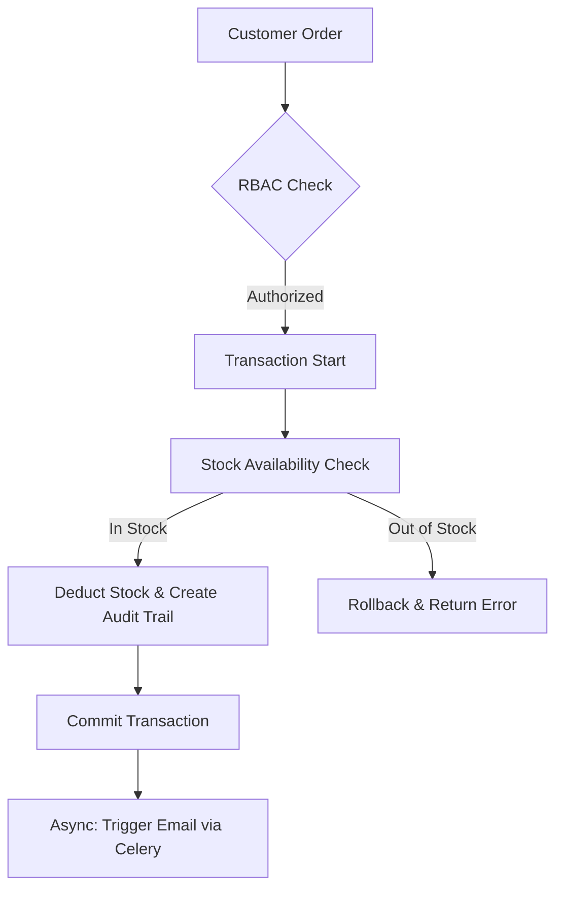

# 📦 Inventory Management System (IMS) - Backend

**A production-ready, high-integrity backend service built with Django & DRF.**

This system is designed around **real-world business workflows**, ensuring data consistency across multiple warehouses, managing complex order lifecycles, and maintaining a strict audit trail of every stock movement.

---

## 🔗 Quick Links
* **Admin Dashboard:** [Production URL](https://inventory-management-backend-production-7584.up.railway.app/admin/)
* **Interactive Docs:** [Swagger UI](https://inventory-management-backend-production-7584.up.railway.app/swagger/) | [Redoc](https://inventory-management-backend-production-7584.up.railway.app/redoc/)

---

## 🏗️ Architectural Highlights

### 1. Data Integrity & Transactions
Inventory systems fail if stock levels go out of sync. I implemented **atomic database transactions** to ensure that stock deduction and transaction logging either succeed together or fail together-preventing "ghost" inventory.

### 2. Scalable RBAC (Role-Based Access Control)
Instead of simple boolean flags, the system uses a structured role system:
* **Admins:** Full system control.
* **Managers:** Warehouse and stock oversight.
* **Staff:** Operational tasks (orders, stock updates).

### 3. Async-First Background Tasks
To keep the API responsive, heavy operations are offloaded to **Celery & Redis**:
* **Email Notifications:** Dispatched via background workers.
* **Stock Alerts:** Automated checks for low-stock items via Celery Beat.
* **Audit Logging:** System-wide triggers for tracking every change.

---

## 🛠 Tech Stack & Why I Chose Them
* **Django 5.2 & DRF:** Chosen for the robust ORM and mature security features required for high-stakes inventory data.
* **PostgreSQL:** Essential for its support of complex relationships and ACID compliance.
* **Celery + Redis:** To handle the distributed nature of modern backend services.
* **Pytest:** Used for a comprehensive suite of **35 tests** covering Unit, Integration, and Async logic.

---

## 📊 Business Logic Flow



---

## 🚀 Key Features

- **Multi-Warehouse Tracking** - Real-time stock visibility across different geographical locations.  
- **Order Lifecycle Management** - Strict state transitions for Purchase and Sales orders.  
- **Audit Trails** - Permanent history of stock movements (who, what, when, and where).  
- **Automated Documentation** - Fully typed Swagger and Redoc support.

## ⚙️ Engineering & Setup

### Requirements
- Docker (Optional but recommended)  
- Python 3.12+  
- Redis (for Celery)

### Local Development

1. Clone & setup environment:
```bash
git clone https://github.com/longreaksa404/inventory-management-backend.git
cd inventory-management-backend
cp .env.example .env  # Configure your DB and Redis URLs
```

2. Install dependencies and run migrations:
```bash
pip install -r requirements.txt
python manage.py migrate
```

3. Run tests:
```bash
pytest  # Runs 35+ tests including domain logic and async task verification
```

(If using Docker, see the repository's Docker configuration for recommended compose commands.)

## 🎯 Project Purpose

This repository serves as a demonstration of production-level backend engineering. It focuses on solving hard problems that matter to real systems - handling race conditions, ensuring data consistency, and providing fine-grained security - and is intended as a foundation for small-to-medium enterprise (SME) inventory systems.
